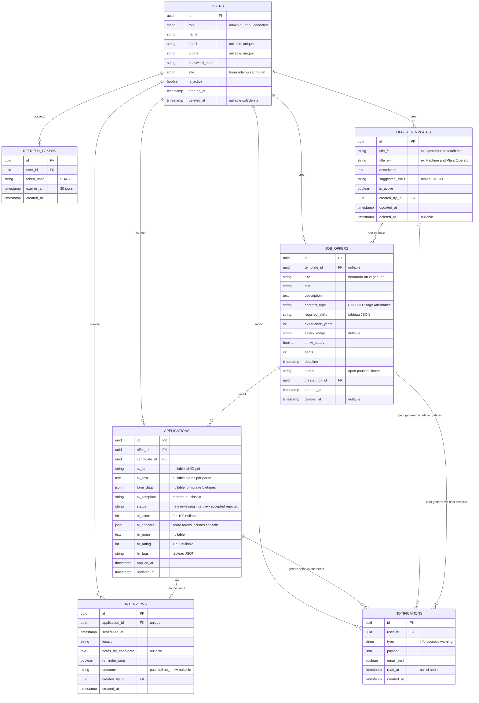

# Diagramme Entité-Relation (ERD)
# Schulte Automotive Tunisia — Base de données PostgreSQL via Prisma ORM

```mermaid
erDiagram
    USERS {
        uuid id PK
        string role "admin ou hr ou candidate"
        string name
        string email "nullable, unique"
        string phone "nullable, unique"
        string password_hash
        string site "bouarada ou zaghouan"
        boolean is_active
        timestamp created_at
        timestamp deleted_at "nullable soft delete"
    }

    REFRESH_TOKENS {
        uuid id PK
        uuid user_id FK
        string token_hash "SHA-256"
        timestamp expires_at "30 jours"
        timestamp created_at
    }

    OFFER_TEMPLATES {
        uuid id PK
        string title_fr "ex Operateur de Machines"
        string title_en "ex Machine and Plant Operator"
        text description
        string suggested_skills "tableau JSON"
        boolean is_active
        uuid created_by_id FK
        timestamp updated_at
        timestamp deleted_at "nullable"
    }

    JOB_OFFERS {
        uuid id PK
        uuid template_id FK "nullable"
        string site "bouarada ou zaghouan"
        string title
        text description
        string contract_type "CDI CDD Stage Alternance"
        string required_skills "tableau JSON"
        int experience_years
        string salary_range "nullable"
        boolean show_salary
        int seats
        timestamp deadline
        string status "open paused closed"
        uuid created_by_id FK
        timestamp created_at
        timestamp deleted_at "nullable"
    }

    APPLICATIONS {
        uuid id PK
        uuid offer_id FK
        uuid candidate_id FK
        string cv_url "nullable UUID.pdf"
        text cv_text "nullable extrait pdf-parse"
        json form_data "nullable formulaire 5 etapes"
        string cv_template "modern ou classic"
        string status "new reviewing interview accepted rejected"
        int ai_score "0 a 100 nullable"
        json ai_analysis "score forces lacunes conseils"
        text hr_notes "nullable"
        int hr_rating "1 a 5 nullable"
        string hr_tags "tableau JSON"
        timestamp applied_at
        timestamp updated_at
    }

    INTERVIEWS {
        uuid id PK
        uuid application_id FK "unique"
        timestamp scheduled_at
        string location
        text notes_for_candidate "nullable"
        boolean reminder_sent
        string outcome "pass fail no_show nullable"
        uuid created_by_id FK
        timestamp created_at
    }

    NOTIFICATIONS {
        uuid id PK
        uuid user_id FK
        string type "info success warning"
        json payload
        boolean email_sent
        timestamp read_at "null si non lu"
        timestamp created_at
    }

    USERS ||--o{ REFRESH_TOKENS : "possede"
    USERS ||--o{ JOB_OFFERS : "cree"
    USERS ||--o{ OFFER_TEMPLATES : "cree"
    USERS ||--o{ APPLICATIONS : "soumet"
    USERS ||--o{ NOTIFICATIONS : "recoit"
    USERS ||--o{ INTERVIEWS : "planifie"
    OFFER_TEMPLATES ||--o{ JOB_OFFERS : "sert de base"
    JOB_OFFERS ||--o{ APPLICATIONS : "recoit"
    APPLICATIONS ||--o| INTERVIEWS : "donne lieu a"
    APPLICATIONS ||--o{ NOTIFICATIONS : "genere selon evenements"
    OFFER_TEMPLATES ||--o{ NOTIFICATIONS : "peut generer via admin updates"
    JOB_OFFERS ||--o{ NOTIFICATIONS : "peut generer via offer lifecycle"
```
