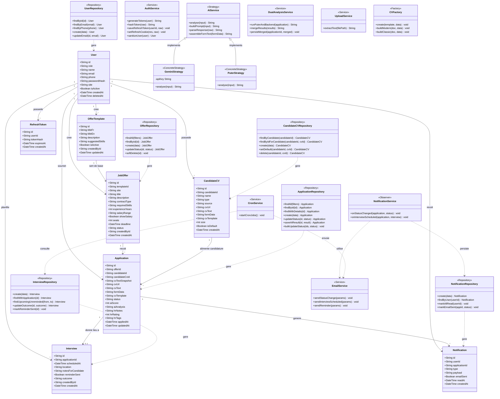

# Diagramme de Classes — Schulte Tunisia
# Entités Prisma, Repositories, Services et Patterns de Conception

```mermaid
classDiagram
    direction TB

    class User {
        +String id
        +String role
        +String name
        +String email
        +String phone
        +String passwordHash
        +String site
        +Boolean isActive
        +DateTime createdAt
        +DateTime deletedAt
    }

    class OfferTemplate {
        +String id
        +String titleFr
        +String titleEn
        +String description
        +String suggestedSkills
        +Boolean isActive
        +String createdById
        +DateTime updatedAt
    }

    class JobOffer {
        +String id
        +String templateId
        +String site
        +String title
        +String description
        +String contractType
        +String requiredSkills
        +Int experienceYears
        +String salaryRange
        +Boolean showSalary
        +Int seats
        +DateTime deadline
        +String status
        +String createdById
        +DateTime createdAt
    }

    class Application {
        +String id
        +String offerId
        +String candidateId
        +String candidateCvId
        +String cvTextSnapshot
        +String cvUrl
        +String cvText
        +String formData
        +String cvTemplate
        +String status
        +Int aiScore
        +String aiAnalysis
        +String hrNotes
        +Int hrRating
        +String hrTags
        +DateTime appliedAt
        +DateTime updatedAt
    }

    class CandidateCV {
        +String id
        +String candidateId
        +String name
        +String type
        +String source
        +String cvUrl
        +String cvText
        +String formData
        +String cvTemplate
        +Int size
        +Boolean isDefault
        +DateTime createdAt
    }

    class Interview {
        +String id
        +String applicationId
        +DateTime scheduledAt
        +String location
        +String notesForCandidate
        +Boolean reminderSent
        +String outcome
        +String createdById
        +DateTime createdAt
    }

    class Notification {
        +String id
        +String userId
        +String applicationId
        +String type
        +String payload
        +Boolean emailSent
        +DateTime readAt
        +DateTime createdAt
    }

    class RefreshToken {
        +String id
        +String userId
        +String tokenHash
        +DateTime expiresAt
        +DateTime createdAt
    }

    class UserRepository {
        <<Repository>>
        +findById(id) User
        +findByEmail(email) User
        +findByPhone(phone) User
        +create(data) User
        +updateEmail(id, email) User
    }

    class OfferRepository {
        <<Repository>>
        +findAll(filters) JobOffer
        +findById(id) JobOffer
        +create(data) JobOffer
        +updateStatus(id, status) JobOffer
        +softDelete(id) void
    }

    class ApplicationRepository {
        <<Repository>>
        +findAll(filters) Application
        +findById(id) Application
        +findWithDetails(id) Application
        +create(data) Application
        +updateStatus(id, status) Application
        +saveAIResult(id, result) Application
        +bulkUpdateStatus(ids, status) void
    }

    class CandidateCVRepository {
        <<Repository>>
        +findByCandidate(candidateId) CandidateCV
        +findByIdForCandidate(candidateId, cvId) CandidateCV
        +create(data) CandidateCV
        +setDefault(candidateId, cvId) CandidateCV
        +delete(candidateId, cvId) CandidateCV
    }

    class InterviewRepository {
        <<Repository>>
        +create(data) Interview
        +findWithApplication(id) Interview
        +findUpcomingUnreminded(from, to) Interview
        +updateOutcome(id, outcome) Interview
        +markReminderSent(id) void
    }

    class NotificationRepository {
        <<Repository>>
        +create(data) Notification
        +findByUser(userId) Notification
        +markAllRead(userId) void
        +markEmailSent(appId, status) void
    }

    class AuthService {
        <<Service>>
        +generateTokens(user) String
        +hashToken(raw) String
        +saveRefreshToken(userId, raw) void
        +setRefreshCookie(res, raw) void
        +sanitizeUser(user) User
    }

    class AIService {
        <<Strategy>>
        +analyse(input) String
        +buildPrompt(input) String
        +parseResponse(raw) String
        +assembleFormText(formData) String
    }

    class DualAnalysisService {
        <<Service>>
        +runPuterAndBackend(application) String
        +mergeResults(results) String
        +persistMerged(applicationId, merged) void
    }

    class GeminiStrategy {
        <<ConcreteStrategy>>
        -apiKey String
        +analyse(input) String
    }

    class PuterStrategy {
        <<ConcreteStrategy>>
        +analyse(input) String
    }

    class NotificationService {
        <<Observer>>
        +onStatusChanged(application, status) void
        +onInterviewScheduled(application, interview) void
    }

    class EmailService {
        <<Service>>
        +sendStatusChange(params) void
        +sendInterviewScheduled(params) void
        +sendReminder(params) void
    }

    class UploadService {
        <<Service>>
        +extractText(filePath) String
    }

    class CronService {
        <<Service>>
        +startCronJobs() void
    }

    class CVFactory {
        <<Factory>>
        +create(template, data) void
        +buildModern(doc, data) void
        +buildClassic(doc, data) void
    }

    User "1" --> "*" RefreshToken : possede
    User "1" --> "*" JobOffer : cree
    User "1" --> "*" OfferTemplate : cree
    User "1" --> "*" Application : soumet
    User "1" --> "*" CandidateCV : possede
    User "1" --> "*" Notification : recoit
    User "1" --> "*" Interview : planifie
    OfferTemplate "1" --> "*" JobOffer : sert de base
    JobOffer "1" --> "*" Application : recoit
    CandidateCV "1" --> "*" Application : alimente candidature
    Application "1" --> "0..1" Interview : donne lieu a
    Application "1" --> "*" Notification : genere

    AIService <|-- GeminiStrategy : implements
    AIService <|-- PuterStrategy : implements

    NotificationService ..> EmailService : utilise
    NotificationService ..> NotificationRepository : persiste
    CronService ..> InterviewRepository : consulte
    CronService ..> EmailService : envoie

    ApplicationRepository ..> Application : gere
    CandidateCVRepository ..> CandidateCV : gere
    OfferRepository ..> JobOffer : gere
    UserRepository ..> User : gere
    InterviewRepository ..> Interview : gere
    NotificationRepository ..> Notification : gere
```
