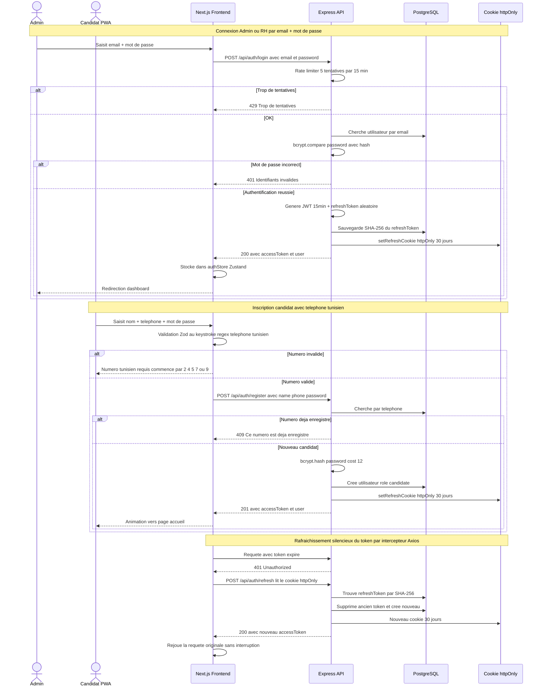

# Diagramme de Sequence — Authentification des 3 Roles
# Admin et RH utilisent email + mot de passe. Candidat utilise telephone tunisien.

```mermaid
sequenceDiagram
    actor Admin as Admin
    actor Candidat as Candidat PWA
    participant Frontend as Next.js Frontend
    participant Backend as Express API
    participant DB as PostgreSQL
    participant Cookie as Cookie httpOnly

    Note over Admin, Cookie: Connexion Admin ou RH par email + mot de passe

    Admin->>Frontend: Saisit email + mot de passe
    Frontend->>Backend: POST /api/auth/login avec email et password
    Backend->>Backend: Rate limiter 5 tentatives par 15 min
    alt Trop de tentatives
        Backend-->>Frontend: 429 Trop de tentatives
    else OK
        Backend->>DB: Cherche utilisateur par email
        Backend->>Backend: bcrypt.compare password avec hash
        alt Mot de passe incorrect
            Backend-->>Frontend: 401 Identifiants invalides
        else Authentification reussie
            Backend->>Backend: Genere JWT 15min + refreshToken aleatoire
            Backend->>DB: Sauvegarde SHA-256 du refreshToken
            Backend->>Cookie: setRefreshCookie httpOnly 30 jours
            Backend-->>Frontend: 200 avec accessToken et user
            Frontend->>Frontend: Stocke dans authStore Zustand
            Frontend-->>Admin: Redirection dashboard
        end
    end

    Note over Candidat, Cookie: Inscription candidat avec telephone tunisien

    Candidat->>Frontend: Saisit nom + telephone + mot de passe
    Frontend->>Frontend: Validation Zod au keystroke regex telephone tunisien
    alt Numero invalide
        Frontend-->>Candidat: Numero tunisien requis commence par 2 4 5 7 ou 9
    else Numero valide
        Frontend->>Backend: POST /api/auth/register avec name phone password
        Backend->>DB: Cherche par telephone
        alt Numero deja enregistre
            Backend-->>Frontend: 409 Ce numero est deja enregistre
        else Nouveau candidat
            Backend->>Backend: bcrypt.hash password cost 12
            Backend->>DB: Cree utilisateur role candidate
            Backend->>Cookie: setRefreshCookie httpOnly 30 jours
            Backend-->>Frontend: 201 avec accessToken et user
            Frontend-->>Candidat: Animation vers page accueil
        end
    end

    Note over Frontend, Cookie: Rafraichissement silencieux du token par intercepteur Axios

    Frontend->>Backend: Requete avec token expire
    Backend-->>Frontend: 401 Unauthorized
    Frontend->>Backend: POST /api/auth/refresh lit le cookie httpOnly
    Backend->>DB: Trouve refreshToken par SHA-256
    Backend->>DB: Supprime ancien token et cree nouveau
    Backend->>Cookie: Nouveau cookie 30 jours
    Backend-->>Frontend: 200 avec nouveau accessToken
    Frontend->>Frontend: Rejoue la requete originale sans interruption
```
