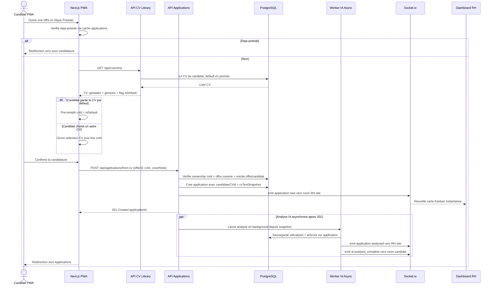

# Diagramme de Sequence — Depot de Candidature (Flow Actuel)
# Flux unique: CV deja dans la bibliotheque candidat (upload ou genere)

```mermaid
sequenceDiagram
    actor Candidat as Candidat PWA
    participant PWA as Next.js PWA
    participant CVAPI as API CV Library
    participant APPAPI as API Applications
    participant DB as PostgreSQL
    participant AI as Worker IA Async
    participant Socket as Socket.io
    participant RH as Dashboard RH

    Candidat->>PWA: Ouvre une offre et clique Postuler
    PWA->>PWA: Verifie deja-postule via cache applications

    alt Deja postule
        PWA-->>Candidat: Redirection vers suivi candidature
    else Non
        PWA->>CVAPI: GET /api/cvs/mine
        CVAPI->>DB: Lit CV du candidat, default en premier
        DB-->>CVAPI: Liste CV
        CVAPI-->>PWA: CV uploades + generes + flag isDefault

        alt Candidat garde le CV par defaut
            PWA->>PWA: Pre-remplit cvId = isDefault
        else Candidat choisit un autre CV
            PWA->>PWA: Ouvre selecteur CV puis fixe cvId
        end

        Candidat->>PWA: Confirme la candidature
        PWA->>APPAPI: POST /api/applications/from-cv {offerId, cvId, coverNote}
        APPAPI->>DB: Verifie ownership cvId + offre ouverte + unicite offre/candidat
        APPAPI->>DB: Cree application avec candidateCVId + cvTextSnapshot
        APPAPI->>Socket: emit application:new vers room RH site
        Socket-->>RH: Nouvelle carte Kanban instantanee
        APPAPI-->>PWA: 201 Created applicationId

        par Analyse IA asynchrone apres 201
            APPAPI->>AI: Lance analyse en background depuis snapshot
            AI->>DB: Sauvegarde aiAnalysis + aiScore sur application
            AI->>Socket: emit application:analysed vers RH site
            AI->>Socket: emit ai:analysis_complete vers room candidat
        end

        PWA-->>Candidat: Redirection vers Applications
    end
```
