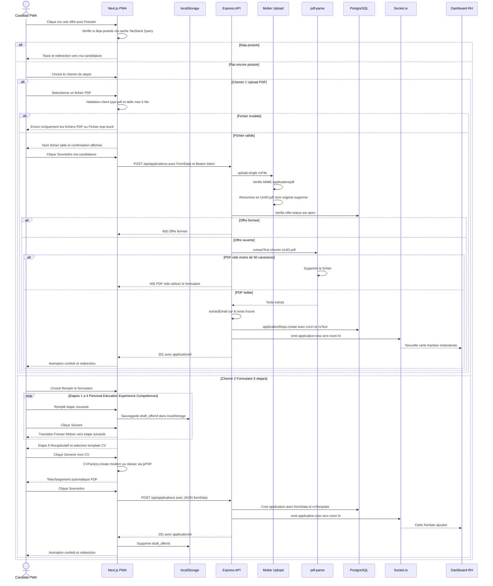

# Diagramme de Sequence — Depot de Candidature
# Deux chemins : Upload PDF et Formulaire Manuel 5 etapes

```mermaid
sequenceDiagram
    actor Candidat as Candidat PWA
    participant PWA as Next.js PWA
    participant LS as localStorage
    participant Backend as Express API
    participant Multer as Multer Upload
    participant PDFParse as pdf-parse
    participant DB as PostgreSQL
    participant Socket as Socket.io
    participant RH as Dashboard RH

    Candidat->>PWA: Clique sur une offre puis Postuler
    PWA->>PWA: Verifie si deja postule via cache TanStack Query

    alt Deja postule
        PWA-->>Candidat: Toast et redirection vers ma candidature
    else Pas encore postule
        Candidat->>PWA: Choisit le chemin de depot

        alt Chemin 1 Upload PDF
            Candidat->>PWA: Selectionne un fichier PDF
            PWA->>PWA: Validation client type pdf et taille max 5 Mo
            alt Fichier invalide
                PWA-->>Candidat: Erreur Uniquement les fichiers PDF ou Fichier trop lourd
            else Fichier valide
                PWA-->>Candidat: Nom fichier taille et confirmation affichee
                Candidat->>PWA: Clique Soumettre ma candidature
                PWA->>Backend: POST /api/applications avec FormData et Bearer token
                Backend->>Multer: upload.single cvFile
                Multer->>Multer: Verifie MIME application/pdf
                Multer->>Multer: Renomme en UUID.pdf nom original supprime
                Backend->>DB: Verifie offer.status est open
                alt Offre fermee
                    Backend-->>PWA: 400 Offre fermee
                else Offre ouverte
                    Backend->>PDFParse: extractText chemin UUID.pdf
                    alt PDF vide moins de 50 caracteres
                        PDFParse->>PDFParse: Supprime le fichier
                        Backend-->>PWA: 400 PDF vide utilisez le formulaire
                    else PDF lisible
                        PDFParse-->>Backend: Texte extrait
                        Backend->>Backend: extractEmail sur le texte trouve
                        Backend->>DB: applicationRepo.create avec cvUrl et cvText
                        Backend->>Socket: emit application:new vers room hr
                        Socket-->>RH: Nouvelle carte Kanban instantanee
                        Backend-->>PWA: 201 avec applicationId
                        PWA-->>Candidat: Animation confetti et redirection
                    end
                end
            end

        else Chemin 2 Formulaire 5 etapes
            Candidat->>PWA: Choisit Remplir le formulaire
            loop Etapes 1 a 4 Personal Education Experience Competences
                Candidat->>PWA: Remplit etape courante
                PWA->>LS: Sauvegarde draft_offerId dans localStorage
                Candidat->>PWA: Clique Suivant
                PWA-->>Candidat: Transition Framer Motion vers etape suivante
            end
            PWA-->>Candidat: Etape 5 Recapitulatif et selection template CV
            Candidat->>PWA: Clique Generer mon CV
            PWA->>PWA: CVFactory.create modern ou classic via jsPDF
            PWA-->>Candidat: Telechargement automatique PDF
            Candidat->>PWA: Clique Soumettre
            PWA->>Backend: POST /api/applications avec JSON formData
            Backend->>DB: Cree application avec formData et cvTemplate
            Backend->>Socket: emit application:new vers room hr
            Socket-->>RH: Carte Kanban ajoutee
            Backend-->>PWA: 201 avec applicationId
            PWA->>LS: Supprime draft_offerId
            PWA-->>Candidat: Animation confetti et redirection
        end
    end
```
