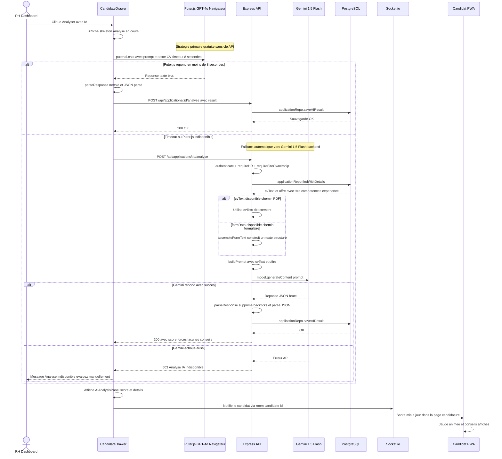

# Diagramme de Sequence — Analyse IA
# Pattern Strategy : Puter.js navigateur en premier puis Gemini 1.5 Flash en fallback

```mermaid
sequenceDiagram
    actor RH as RH Dashboard
    participant Drawer as CandidateDrawer
    participant PuterJS as Puter.js GPT-4o Navigateur
    participant Backend as Express API
    participant Gemini as Gemini 1.5 Flash
    participant DB as PostgreSQL
    participant Socket as Socket.io
    participant PWA as Candidat PWA

    RH->>Drawer: Clique Analyser avec IA
    Drawer->>Drawer: Affiche skeleton Analyse en cours

    Note over PuterJS: Strategie primaire gratuite sans cle API

    Drawer->>PuterJS: puter.ai.chat avec prompt et texte CV timeout 8 secondes

    alt Puter.js repond en moins de 8 secondes
        PuterJS-->>Drawer: Reponse texte brut
        Drawer->>Drawer: parseResponse nettoie et JSON.parse
        Drawer->>Backend: POST /api/applications/:id/analyse avec result
        Backend->>DB: applicationRepo.saveAIResult
        DB-->>Backend: Sauvegarde OK
        Backend-->>Drawer: 200 OK

    else Timeout ou Puter.js indisponible
        Note over Backend, Gemini: Fallback automatique vers Gemini 1.5 Flash backend

        Drawer->>Backend: POST /api/applications/:id/analyse
        Backend->>Backend: authenticate + requireHR + requireSiteOwnership
        Backend->>DB: applicationRepo.findWithDetails
        DB-->>Backend: cvText et offre avec titre competences experience

        alt cvText disponible chemin PDF
            Backend->>Backend: Utilise cvText directement
        else formData disponible chemin formulaire
            Backend->>Backend: assembleFormText construit un texte structure
        end

        Backend->>Backend: buildPrompt avec cvText et offre
        Backend->>Gemini: model.generateContent prompt

        alt Gemini repond avec succes
            Gemini-->>Backend: Reponse JSON brute
            Backend->>Backend: parseResponse supprime backticks et parse JSON
            Backend->>DB: applicationRepo.saveAIResult
            DB-->>Backend: OK
            Backend-->>Drawer: 200 avec score forces lacunes conseils

        else Gemini echoue aussi
            Gemini-->>Backend: Erreur API
            Backend-->>Drawer: 503 Analyse IA indisponible
            Drawer-->>RH: Message Analyse indisponible evaluez manuellement
        end
    end

    Drawer->>Drawer: Affiche AIAnalysisPanel score et details
    Drawer->>Socket: Notifie le candidat via room candidate id
    Socket-->>PWA: Score mis a jour dans la page candidature
    PWA-->>PWA: Jauge animee et conseils affiches
```
