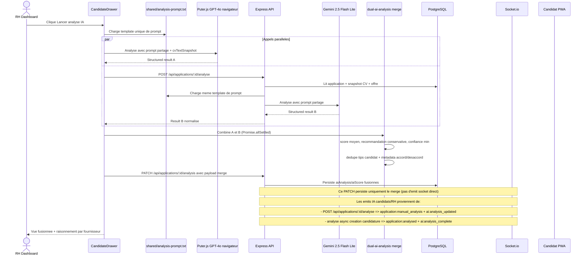

# Diagramme de Sequence — Analyse IA Dual Provider
# Meme prompt partage entre Puter.js (navigateur) et backend Gemini, puis fusion conserveatrice

```mermaid
sequenceDiagram
    actor RH as RH Dashboard
    participant Drawer as CandidateDrawer
    participant Prompt as shared/analysis-prompt.txt
    participant Puter as Puter.js GPT-4o navigateur
    participant Backend as Express API
    participant Gemini as Gemini 2.5 Flash Lite
    participant Merge as dual-ai-analysis merge
    participant DB as PostgreSQL
    participant Socket as Socket.io
    participant PWA as Candidat PWA

    RH->>Drawer: Clique Lancer analyse IA
    Drawer->>Prompt: Charge template unique de prompt

    par Appels paralleles
        Drawer->>Puter: Analyse avec prompt partage + cvTextSnapshot
        Puter-->>Drawer: Structured result A
    and
        Drawer->>Backend: POST /api/applications/:id/analyse
        Backend->>DB: Lit application + snapshot CV + offre
        Backend->>Prompt: Charge meme template de prompt
        Backend->>Gemini: Analyse avec prompt partage
        Gemini-->>Backend: Structured result B
        Backend-->>Drawer: Result B normalise
    end

    Drawer->>Merge: Combine A et B (Promise.allSettled)
    Merge->>Merge: score moyen, recommandation conservative, confiance min
    Merge->>Merge: dedupe tips candidat + metadata accord/desaccord

    Drawer->>Backend: PATCH /api/applications/:id/analysis avec payload merge
    Backend->>DB: Persiste aiAnalysis/aiScore fusionnes
    Note over Backend, Socket: Ce PATCH persiste uniquement le merge (pas d'emit socket direct)

    Note over Backend, Socket: Les emits IA candidats/RH proviennent de:
    Note over Backend, Socket: - POST /api/applications/:id/analyse => application:manual_analysis + ai:analysis_updated
    Note over Backend, Socket: - analyse async creation candidature => application:analysed + ai:analysis_complete

    Drawer-->>RH: Vue fusionnee + raisonnement par fournisseur
```
