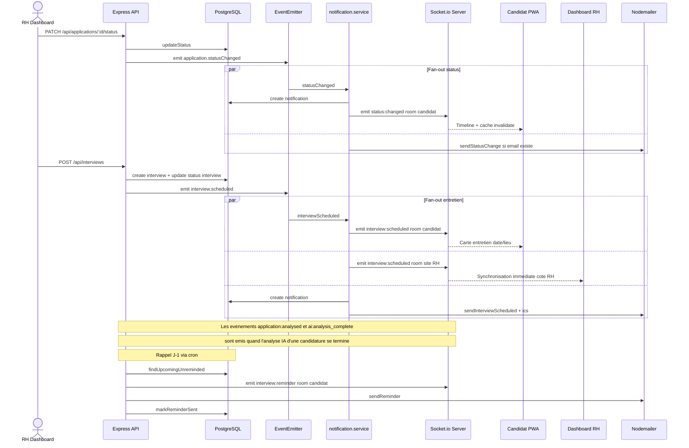

# Diagramme de Sequence — Flux Temps Reel Socket.io (Actuel)

```mermaid
sequenceDiagram
    actor RH as RH Dashboard
    participant API as Express API
    participant DB as PostgreSQL
    participant Emitter as EventEmitter
    participant NotifSvc as notification.service
    participant Socket as Socket.io Server
    participant PWA as Candidat PWA
    participant HRUI as Dashboard RH
    participant Email as Nodemailer

    RH->>API: PATCH /api/applications/:id/status
    API->>DB: updateStatus
    API->>Emitter: emit application.statusChanged

    par Fan-out status
        Emitter->>NotifSvc: statusChanged
        NotifSvc->>DB: create notification
        NotifSvc->>Socket: emit status:changed room candidat
        Socket-->>PWA: Timeline + cache invalidate
    and
        NotifSvc->>Email: sendStatusChange si email existe
    end

    RH->>API: POST /api/interviews
    API->>DB: create interview + update status interview
    API->>Emitter: emit interview.scheduled

    par Fan-out entretien
        Emitter->>NotifSvc: interviewScheduled
        NotifSvc->>Socket: emit interview:scheduled room candidat
        Socket-->>PWA: Carte entretien date/lieu
    and
        NotifSvc->>Socket: emit interview:scheduled room site RH
        Socket-->>HRUI: Synchronisation immediate cote RH
    and
        NotifSvc->>DB: create notification
        NotifSvc->>Email: sendInterviewScheduled + ics
    end

    Note over API, Socket: Les evenements application:analysed et ai:analysis_complete
    Note over API, Socket: sont emis quand l'analyse IA d'une candidature se termine

    Note over API, DB: Rappel J-1 via cron
    API->>DB: findUpcomingUnreminded
    API->>Socket: emit interview:reminder room candidat
    API->>Email: sendReminder
    API->>DB: markReminderSent
```
