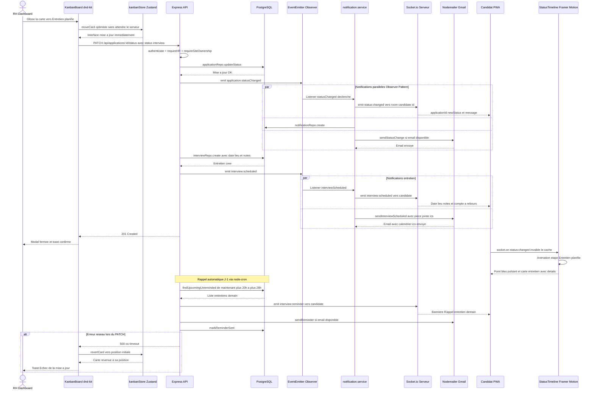

# Diagramme de Sequence — Flux Temps Reel Socket.io
# RH déplace une carte Kanban et le telephone du candidat se met a jour instantanement

```mermaid
sequenceDiagram
    actor RH as RH Dashboard
    participant Kanban as KanbanBoard dnd-kit
    participant Zustand as kanbanStore Zustand
    participant API as Express API
    participant DB as PostgreSQL
    participant Emitter as EventEmitter Observer
    participant NotifSvc as notification.service
    participant SocketSrv as Socket.io Serveur
    participant Email as Nodemailer Gmail
    participant PWA as Candidat PWA
    participant Timeline as StatusTimeline Framer Motion

    RH->>Kanban: Glisse la carte vers Entretien planifie
    Kanban->>Zustand: moveCard optimiste sans attendre le serveur
    Zustand-->>Kanban: Interface mise a jour immediatement

    Kanban->>API: PATCH /api/applications/:id/status avec status interview
    API->>API: authenticate + requireHR + requireSiteOwnership
    API->>DB: applicationRepo.updateStatus
    DB-->>API: Mise a jour OK

    API->>Emitter: emit application.statusChanged

    par Notifications paralleles Observer Pattern
        Emitter->>NotifSvc: Listener statusChanged declenche
        NotifSvc->>SocketSrv: emit status:changed vers room candidate id
        SocketSrv-->>PWA: applicationId newStatus et message
    and
        NotifSvc->>DB: notificationRepo.create
    and
        NotifSvc->>Email: sendStatusChange si email disponible
        Email-->>NotifSvc: Email envoye
    end

    API->>DB: interviewRepo.create avec date lieu et notes
    DB-->>API: Entretien cree
    API->>Emitter: emit interview.scheduled

    par Notifications entretien
        Emitter->>NotifSvc: Listener interviewScheduled
        NotifSvc->>SocketSrv: emit interview:scheduled vers candidate
        SocketSrv-->>PWA: Date lieu notes et compte a rebours
    and
        NotifSvc->>Email: sendInterviewScheduled avec piece jointe ics
        Email-->>NotifSvc: Email avec calendrier ics envoye
    end

    API-->>Kanban: 201 Created
    Kanban-->>RH: Modal fermee et toast confirme

    PWA->>Timeline: socket.on status:changed invalide le cache
    Timeline->>Timeline: Animation etape Entretien planifie
    Timeline-->>PWA: Point bleu pulsant et carte entretien avec details

    Note over API, DB: Rappel automatique J-1 via node-cron

    API->>DB: findUpcomingUnreminded de maintenant plus 20h a plus 28h
    DB-->>API: Liste entretiens demain
    API->>SocketSrv: emit interview:reminder vers candidate
    SocketSrv-->>PWA: Banniere Rappel entretien demain
    API->>Email: sendReminder si email disponible
    API->>DB: markReminderSent

    alt Erreur reseau lors du PATCH
        API-->>Kanban: 500 ou timeout
        Kanban->>Zustand: revertCard vers position initiale
        Zustand-->>Kanban: Carte revenue a sa position
        Kanban-->>RH: Toast Echec de la mise a jour
    end
```
