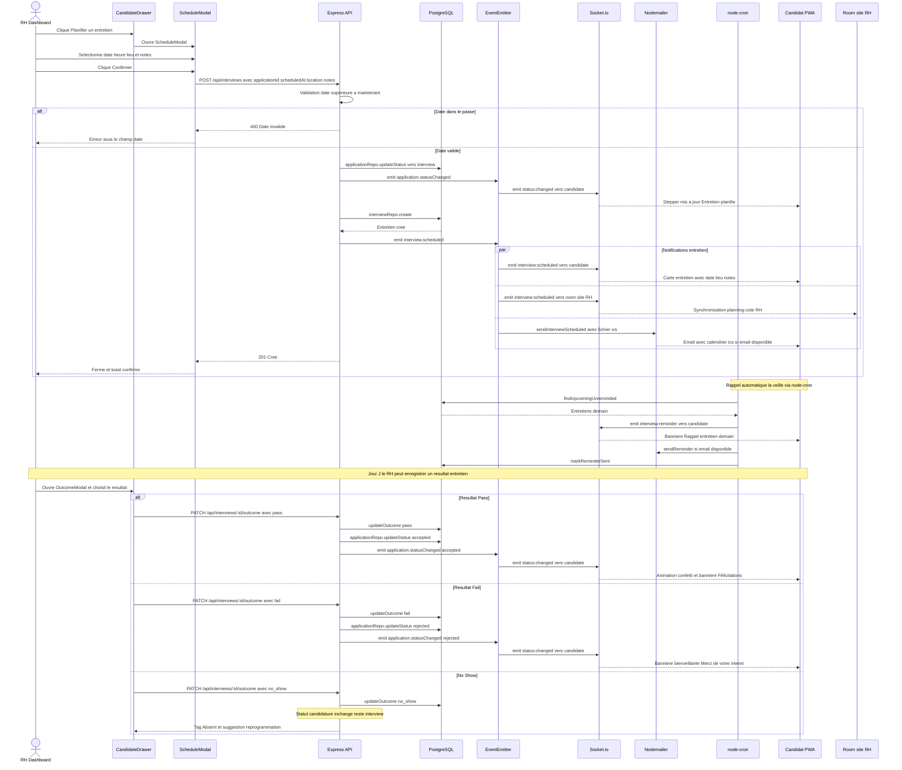

# Diagramme de Sequence — Planification Entretien et Decision Finale

```mermaid
sequenceDiagram
    actor RH as RH Dashboard
    participant Drawer as CandidateDrawer
    participant Modal as ScheduleModal
    participant API as Express API
    participant DB as PostgreSQL
    participant Emitter as EventEmitter
    participant Socket as Socket.io
    participant Email as Nodemailer
    participant Cron as node-cron
    participant PWA as Candidat PWA
    participant HRSite as Room site RH

    RH->>Drawer: Clique Planifier un entretien
    Drawer->>Modal: Ouvre ScheduleModal

    RH->>Modal: Selectionne date heure lieu et notes
    RH->>Modal: Clique Confirmer

    Modal->>API: POST /api/interviews avec applicationId scheduledAt location notes
    API->>API: Validation date superieure a maintenant

    alt Date dans le passe
        API-->>Modal: 400 Date invalide
        Modal-->>RH: Erreur sous le champ date
    else Date valide
        API->>DB: applicationRepo.updateStatus vers interview
        API->>Emitter: emit application.statusChanged
        Emitter->>Socket: emit status:changed vers candidate
        Socket-->>PWA: Stepper mis a jour Entretien planifie

        API->>DB: interviewRepo.create
        DB-->>API: Entretien cree
        API->>Emitter: emit interview.scheduled

        par Notifications entretien
            Emitter->>Socket: emit interview:scheduled vers candidate
            Socket-->>PWA: Carte entretien avec date lieu notes
        and
            Emitter->>Socket: emit interview:scheduled vers room site RH
            Socket-->>HRSite: Synchronisation planning cote RH
        and
            Emitter->>Email: sendInterviewScheduled avec fichier ics
            Email-->>PWA: Email avec calendrier ics si email disponible
        end

        API-->>Modal: 201 Cree
        Modal-->>RH: Ferme et toast confirme
    end

    Note over Cron, PWA: Rappel automatique la veille via node-cron

    Cron->>DB: findUpcomingUnreminded
    DB-->>Cron: Entretiens demain
    Cron->>Socket: emit interview:reminder vers candidate
    Socket-->>PWA: Banniere Rappel entretien demain
    Cron->>Email: sendReminder si email disponible
    Cron->>DB: markReminderSent

    Note over RH, PWA: Jour J le RH peut enregistrer un resultat entretien

    RH->>Drawer: Ouvre OutcomeModal et choisit le resultat

    alt Resultat Pass
        Drawer->>API: PATCH /api/interviews/:id/outcome avec pass
        API->>DB: updateOutcome pass
        API->>DB: applicationRepo.updateStatus accepted
        API->>Emitter: emit application.statusChanged accepted
        Emitter->>Socket: emit status:changed vers candidate
        Socket-->>PWA: Animation confetti et banniere Félicitations

    else Resultat Fail
        Drawer->>API: PATCH /api/interviews/:id/outcome avec fail
        API->>DB: updateOutcome fail
        API->>DB: applicationRepo.updateStatus rejected
        API->>Emitter: emit application.statusChanged rejected
        Emitter->>Socket: emit status:changed vers candidate
        Socket-->>PWA: Banniere bienveillante Merci de votre interet

    else No Show
        Drawer->>API: PATCH /api/interviews/:id/outcome avec no_show
        API->>DB: updateOutcome no_show
        Note over API: Statut candidature inchange reste interview
        API-->>Drawer: Tag Absent et suggestion reprogrammation
    end
```
