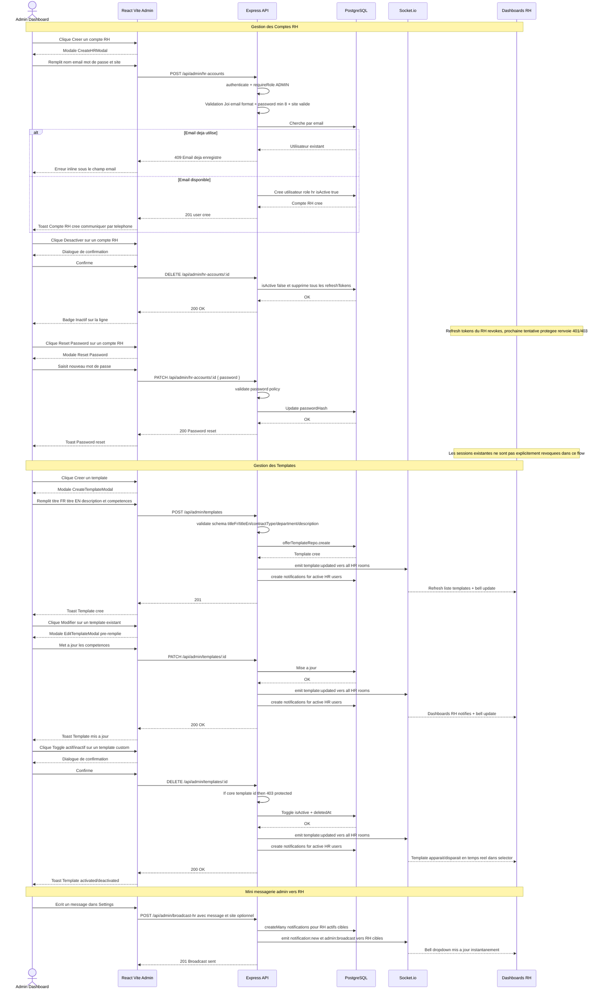

# Diagramme de Sequence — Administration Comptes RH, Templates et Broadcast RH

```mermaid
sequenceDiagram
    actor Admin as Admin Dashboard
    participant AdminUI as React Vite Admin
    participant API as Express API
    participant DB as PostgreSQL
    participant Socket as Socket.io
    participant HR as Dashboards RH

    Note over Admin, HR: Gestion des Comptes RH

    Admin->>AdminUI: Clique Creer un compte RH
    AdminUI-->>Admin: Modale CreateHRModal
    Admin->>AdminUI: Remplit nom email mot de passe et site
    AdminUI->>API: POST /api/admin/hr-accounts
    API->>API: authenticate + requireRole ADMIN
    API->>API: Validation Joi email format + password min 8 + site valide
    API->>DB: Cherche par email
    alt Email deja utilise
        DB-->>API: Utilisateur existant
        API-->>AdminUI: 409 Email deja enregistre
        AdminUI-->>Admin: Erreur inline sous le champ email
    else Email disponible
        API->>DB: Cree utilisateur role hr isActive true
        DB-->>API: Compte RH cree
        API-->>AdminUI: 201 user cree
        AdminUI-->>Admin: Toast Compte RH cree communiquer par telephone
    end

    Admin->>AdminUI: Clique Desactiver sur un compte RH
    AdminUI-->>Admin: Dialogue de confirmation
    Admin->>AdminUI: Confirme
    AdminUI->>API: DELETE /api/admin/hr-accounts/:id
    API->>DB: isActive false et supprime tous les refreshTokens
    DB-->>API: OK
    API-->>AdminUI: 200 OK
    AdminUI-->>Admin: Badge Inactif sur la ligne
    Note over HR: Refresh tokens du RH revokes, prochaine tentative protegee renvoie 401/403

    Admin->>AdminUI: Clique Reset Password sur un compte RH
    AdminUI-->>Admin: Modale Reset Password
    Admin->>AdminUI: Saisit nouveau mot de passe
    AdminUI->>API: PATCH /api/admin/hr-accounts/:id { password }
    API->>API: validate password policy
    API->>DB: Update passwordHash
    DB-->>API: OK
    API-->>AdminUI: 200 Password reset
    AdminUI-->>Admin: Toast Password reset
    Note over HR: Les sessions existantes ne sont pas explicitement revoquees dans ce flow

    Note over Admin, HR: Gestion des Templates

    Admin->>AdminUI: Clique Creer un template
    AdminUI-->>Admin: Modale CreateTemplateModal
    Admin->>AdminUI: Remplit titre FR titre EN description et competences
    AdminUI->>API: POST /api/admin/templates
    API->>API: validate schema titleFr/titleEn/contractType/department/description
    API->>DB: offerTemplateRepo.create
    DB-->>API: Template cree
    API->>Socket: emit template:updated vers all HR rooms
    API->>DB: create notifications for active HR users
    Socket-->>HR: Refresh liste templates + bell update
    API-->>AdminUI: 201
    AdminUI-->>Admin: Toast Template cree

    Admin->>AdminUI: Clique Modifier sur un template existant
    AdminUI-->>Admin: Modale EditTemplateModal pre-remplie
    Admin->>AdminUI: Met a jour les competences
    AdminUI->>API: PATCH /api/admin/templates/:id
    API->>DB: Mise a jour
    DB-->>API: OK
    API->>Socket: emit template:updated vers all HR rooms
    API->>DB: create notifications for active HR users
    Socket-->>HR: Dashboards RH notifies + bell update
    API-->>AdminUI: 200 OK
    AdminUI-->>Admin: Toast Template mis a jour

    Admin->>AdminUI: Clique Toggle actif/inactif sur un template custom
    AdminUI-->>Admin: Dialogue de confirmation
    Admin->>AdminUI: Confirme
    AdminUI->>API: DELETE /api/admin/templates/:id
    API->>API: If core template id then 403 protected
    API->>DB: Toggle isActive + deletedAt
    DB-->>API: OK
    API->>Socket: emit template:updated vers all HR rooms
    API->>DB: create notifications for active HR users
    Socket-->>HR: Template apparait/disparait en temps reel dans selector
    API-->>AdminUI: 200 OK
    AdminUI-->>Admin: Toast Template activated/deactivated

    Note over Admin, HR: Mini messagerie admin vers RH
    Admin->>AdminUI: Ecrit un message dans Settings
    AdminUI->>API: POST /api/admin/broadcast-hr avec message et site optionnel
    API->>DB: createMany notifications pour RH actifs cibles
    API->>Socket: emit notification:new et admin:broadcast vers RH cibles
    Socket-->>HR: Bell dropdown mis a jour instantanement
    API-->>AdminUI: 201 Broadcast sent
```
