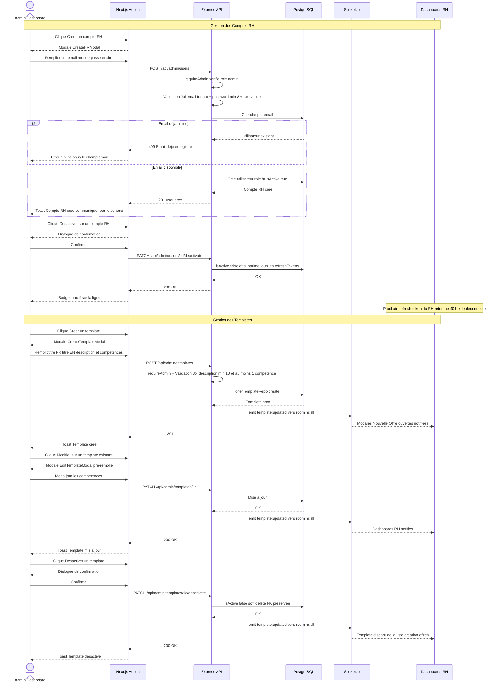

# Diagramme de Sequence — Administration Comptes RH et Templates

```mermaid
sequenceDiagram
    actor Admin as Admin Dashboard
    participant AdminUI as Next.js Admin
    participant API as Express API
    participant DB as PostgreSQL
    participant Socket as Socket.io
    participant HR as Dashboards RH

    Note over Admin, HR: Gestion des Comptes RH

    Admin->>AdminUI: Clique Creer un compte RH
    AdminUI-->>Admin: Modale CreateHRModal
    Admin->>AdminUI: Remplit nom email mot de passe et site
    AdminUI->>API: POST /api/admin/users
    API->>API: requireAdmin verifie role admin
    API->>API: Validation Joi email format + password min 8 + site valide
    API->>DB: Cherche par email
    alt Email deja utilise
        DB-->>API: Utilisateur existant
        API-->>AdminUI: 409 Email deja enregistre
        AdminUI-->>Admin: Erreur inline sous le champ email
    else Email disponible
        API->>DB: Cree utilisateur role hr isActive true
        DB-->>API: Compte RH cree
        API-->>AdminUI: 201 user cree
        AdminUI-->>Admin: Toast Compte RH cree communiquer par telephone
    end

    Admin->>AdminUI: Clique Desactiver sur un compte RH
    AdminUI-->>Admin: Dialogue de confirmation
    Admin->>AdminUI: Confirme
    AdminUI->>API: PATCH /api/admin/users/:id/deactivate
    API->>DB: isActive false et supprime tous les refreshTokens
    DB-->>API: OK
    API-->>AdminUI: 200 OK
    AdminUI-->>Admin: Badge Inactif sur la ligne
    Note over HR: Prochain refresh token du RH retourne 401 et le deconnecte

    Note over Admin, HR: Gestion des Templates

    Admin->>AdminUI: Clique Creer un template
    AdminUI-->>Admin: Modale CreateTemplateModal
    Admin->>AdminUI: Remplit titre FR titre EN description et competences
    AdminUI->>API: POST /api/admin/templates
    API->>API: requireAdmin + Validation Joi description min 10 et au moins 1 competence
    API->>DB: offerTemplateRepo.create
    DB-->>API: Template cree
    API->>Socket: emit template:updated vers room hr:all
    Socket-->>HR: Modales Nouvelle Offre ouvertes notifiees
    API-->>AdminUI: 201
    AdminUI-->>Admin: Toast Template cree

    Admin->>AdminUI: Clique Modifier sur un template existant
    AdminUI-->>Admin: Modale EditTemplateModal pre-remplie
    Admin->>AdminUI: Met a jour les competences
    AdminUI->>API: PATCH /api/admin/templates/:id
    API->>DB: Mise a jour
    DB-->>API: OK
    API->>Socket: emit template:updated vers room hr:all
    Socket-->>HR: Dashboards RH notifies
    API-->>AdminUI: 200 OK
    AdminUI-->>Admin: Toast Template mis a jour

    Admin->>AdminUI: Clique Desactiver un template
    AdminUI-->>Admin: Dialogue de confirmation
    Admin->>AdminUI: Confirme
    AdminUI->>API: PATCH /api/admin/templates/:id/deactivate
    API->>DB: isActive false soft delete FK preservee
    DB-->>API: OK
    API->>Socket: emit template:updated vers room hr:all
    Socket-->>HR: Template disparu de la liste creation offres
    API-->>AdminUI: 200 OK
    AdminUI-->>Admin: Toast Template desactive
```
