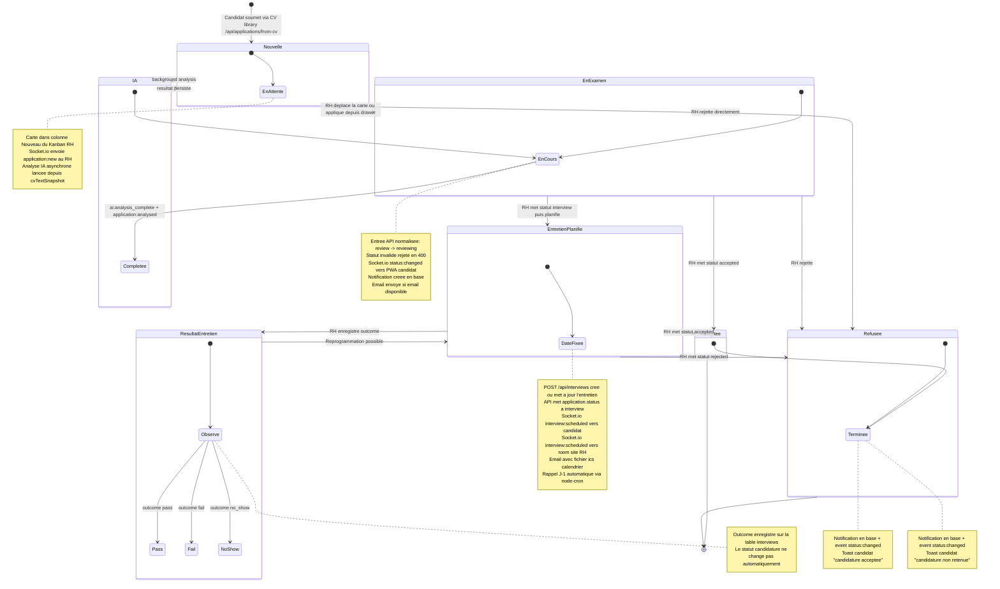

# Diagramme d'Etats — Cycle de Vie d'une Candidature
# ApplicationStatus : new reviewing interview accepted rejected

```mermaid
stateDiagram-v2
    direction TB

    [*] --> Nouvelle : Candidat soumet via CV library /api/applications/from-cv

    state Nouvelle {
        [*] --> EnAttente
        note right of EnAttente
            Carte dans colonne Nouveau du Kanban RH
            Socket.io envoie application:new au RH
            Analyse IA asynchrone lancee depuis cvTextSnapshot
        end note
    }

    state IA {
        [*] --> EnCours
        EnCours --> Completee : ai:analysis_complete + application:analysed
    }

    Nouvelle --> IA : background analysis
    IA --> Nouvelle : resultat persiste

    Nouvelle --> EnExamen : RH deplace la carte ou applique depuis drawer
    Nouvelle --> Refusee : RH rejette directement

    state EnExamen {
        [*] --> EnCours
        note right of EnCours
            Entree API normalisee: review -> reviewing
            Statut invalide rejete en 400
            Socket.io status:changed vers PWA candidat
            Notification creee en base
            Email envoye si email disponible
        end note
    }

    EnExamen --> EntretienPlanifie : RH met statut interview puis planifie
    EnExamen --> Acceptee : RH met statut accepted
    EnExamen --> Refusee : RH rejette

    state EntretienPlanifie {
        [*] --> DateFixee
        note right of DateFixee
            POST /api/interviews cree ou met a jour l'entretien
            API met application.status a interview
            Socket.io interview:scheduled vers candidat
            Socket.io interview:scheduled vers room site RH
            Email avec fichier ics calendrier
            Rappel J-1 automatique via node-cron
        end note
    }

    EntretienPlanifie --> ResultatEntretien : RH enregistre outcome
    state ResultatEntretien {
        [*] --> Observe
        Observe --> Pass : outcome pass
        Observe --> Fail : outcome fail
        Observe --> NoShow : outcome no_show
        note right of Observe
            Outcome enregistre sur la table interviews
            Le statut candidature ne change pas automatiquement
        end note
    }
    ResultatEntretien --> EntretienPlanifie : Reprogrammation possible

    EntretienPlanifie --> Acceptee : RH met statut accepted
    EntretienPlanifie --> Refusee : RH met statut rejected

    state Acceptee {
        [*] --> Terminee
        note right of Terminee
            Notification en base + event status:changed
            Toast candidat "candidature acceptee"
        end note
    }

    state Refusee {
        [*] --> Terminee
        note right of Terminee
            Notification en base + event status:changed
            Toast candidat "candidature non retenue"
        end note
    }

    Acceptee --> [*]
    Refusee --> [*]
```
