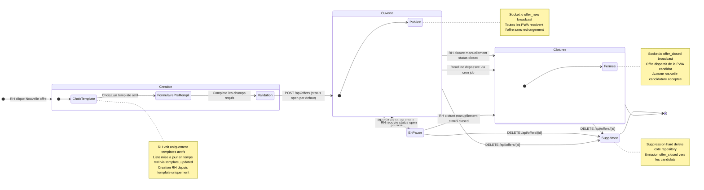

# Diagramme d'Etats — Cycle de Vie d'une Offre d'Emploi
# OfferStatus : open paused closed

```mermaid
stateDiagram-v2
    direction LR

    [*] --> Creation : RH clique Nouvelle offre

    state Creation {
        [*] --> ChoixTemplate
        ChoixTemplate --> FormulairePreRempli : Choisit un template actif
        FormulairePreRempli --> Validation : Complete les champs requis
        note right of ChoixTemplate
            RH voit uniquement templates actifs
            Liste mise a jour en temps reel via template_updated
            Creation RH depuis template uniquement
        end note
    }

    Validation --> Ouverte : POST /api/offers (status open par defaut)

    state Ouverte {
        [*] --> Publiee
        note right of Publiee
            Socket.io offer_new broadcast
            Toutes les PWA recoivent l'offre sans rechargement
        end note
    }

    Ouverte --> EnPause : RH met en pause status paused
    EnPause --> Ouverte : RH reouvre status open

    Ouverte --> Cloturee : RH cloture manuellement status closed
    Ouverte --> Cloturee : Deadline depassee via cron job
    EnPause --> Cloturee : RH cloture manuellement status closed

    state Cloturee {
        [*] --> Fermee
        note right of Fermee
            Socket.io offer_closed broadcast
            Offre disparait de la PWA candidat
            Aucune nouvelle candidature acceptee
        end note
    }

    Ouverte --> Supprimee : DELETE /api/offers/{id}
    EnPause --> Supprimee : DELETE /api/offers/{id}
    Cloturee --> Supprimee : DELETE /api/offers/{id}
    note right of Supprimee
        Suppression hard delete cote repository
        Emission offer_closed vers les candidats
    end note

    Cloturee --> [*]
    Supprimee --> [*]
```
