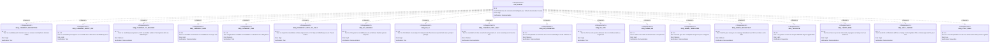

# Diagramme des Exigences — Schulte Tunisia Recruitment Platform

```mermaid
requirementDiagram

    requirement PFE_Schulte {
        id: 1
        text: "Plateforme de recrutement intelligent pour Schulte Automotive Tunisia"
        risk: high
        verifymethod: demonstration
    }

    requirement REQ_CANDIDAT_INSCRIPTION {
        id: 1.1
        text: "Le candidat peut s'inscrire avec un numero de telephone tunisien valide"
        risk: high
        verifymethod: test
    }

    requirement REQ_CANDIDAT_DEPOT_PDF {
        id: 1.2
        text: "Le candidat peut deposer un CV PDF max 5 Mo dans sa bibliotheque CV"
        risk: high
        verifymethod: test
    }

    requirement REQ_CANDIDAT_CV_BUILDER {
        id: 1.3
        text: "Le candidat peut generer un CV via builder valide et l'enregistrer dans sa bibliotheque"
        risk: medium
        verifymethod: demonstration
    }

    requirement REQ_CANDIDAT_APPLY_CV_ONLY {
        id: 1.6
        text: "Le depot de candidature utilise uniquement un CV deja en bibliotheque avec CV par defaut"
        risk: high
        verifymethod: test
    }

    requirement REQ_CANDIDAT_SUIVI {
        id: 1.4
        text: "Le candidat suit l'etat de sa candidature en temps reel"
        risk: high
        verifymethod: demonstration
    }

    requirement REQ_CANDIDAT_PWA {
        id: 1.5
        text: "L'application candidat est installable sur Android sans Play Store"
        risk: medium
        verifymethod: test
    }

    requirement REQ_RH_KANBAN {
        id: 2.1
        text: "Le RH gere les candidatures via un tableau Kanban glisser-deposer"
        risk: high
        verifymethod: demonstration
    }

    requirement REQ_RH_IA {
        id: 2.2
        text: "Le RH obtient une analyse IA dual provider fusionnee et persistante avec prompt partage"
        risk: high
        verifymethod: test
    }

    requirement REQ_CANDIDAT_TIPS_ONLY {
        id: 2.5
        text: "Le candidat voit des conseils IA uniquement; le score numerique est reserve RH"
        risk: medium
        verifymethod: demonstration
    }

    requirement REQ_RH_ENTRETIEN {
        id: 2.3
        text: "Le RH planifie un entretien avec envoi automatique email et fichier ics"
        risk: medium
        verifymethod: demonstration
    }

    requirement REQ_RH_SITE {
        id: 2.4
        text: "Le RH ne voit que les donnees de son site Bouarada ou Zaghouan"
        risk: high
        verifymethod: test
    }

    requirement REQ_ADMIN_HR {
        id: 3.1
        text: "L'admin cree edite et desactive les comptes RH"
        risk: high
        verifymethod: demonstration
    }

    requirement REQ_ADMIN_TEMPLATES {
        id: 3.2
        text: "L'admin gere les 7 templates de postes pre-configures"
        risk: medium
        verifymethod: demonstration
    }

    requirement REQ_ADMIN_BROADCAST {
        id: 3.3
        text: "L'admin peut envoyer un message broadcast aux RH tous sites ou site cible"
        risk: medium
        verifymethod: demonstration
    }

    requirement REQ_SECURITE {
        id: 4.1
        text: "Le systeme couvre les risques OWASP Top 10 applicables"
        risk: high
        verifymethod: inspection
    }

    requirement REQ_TEMPS_REEL {
        id: 4.2
        text: "Les mises a jour de statut sont propagees en temps reel via Socket.io"
        risk: high
        verifymethod: demonstration
    }

    requirement REQ_BELL_UNIFIEE {
        id: 4.4
        text: "La cloche notifications affiche en temps reel templates offres et messages admin pour RH"
        risk: high
        verifymethod: demonstration
    }

    requirement REQ_COUT_ZERO {
        id: 4.3
        text: "Le cout d'exploitation est de zero dinars stack 100 pourcent gratuit"
        risk: low
        verifymethod: inspection
    }

    PFE_Schulte - traces -> REQ_CANDIDAT_INSCRIPTION
    PFE_Schulte - traces -> REQ_CANDIDAT_DEPOT_PDF
    PFE_Schulte - traces -> REQ_CANDIDAT_CV_BUILDER
    PFE_Schulte - traces -> REQ_CANDIDAT_SUIVI
    PFE_Schulte - traces -> REQ_CANDIDAT_PWA
    PFE_Schulte - traces -> REQ_CANDIDAT_APPLY_CV_ONLY
    PFE_Schulte - traces -> REQ_RH_KANBAN
    PFE_Schulte - traces -> REQ_RH_IA
    PFE_Schulte - traces -> REQ_CANDIDAT_TIPS_ONLY
    PFE_Schulte - traces -> REQ_RH_ENTRETIEN
    PFE_Schulte - traces -> REQ_RH_SITE
    PFE_Schulte - traces -> REQ_ADMIN_HR
    PFE_Schulte - traces -> REQ_ADMIN_TEMPLATES
    PFE_Schulte - traces -> REQ_ADMIN_BROADCAST
    PFE_Schulte - traces -> REQ_SECURITE
    PFE_Schulte - traces -> REQ_TEMPS_REEL
    PFE_Schulte - traces -> REQ_BELL_UNIFIEE
    PFE_Schulte - traces -> REQ_COUT_ZERO
```
