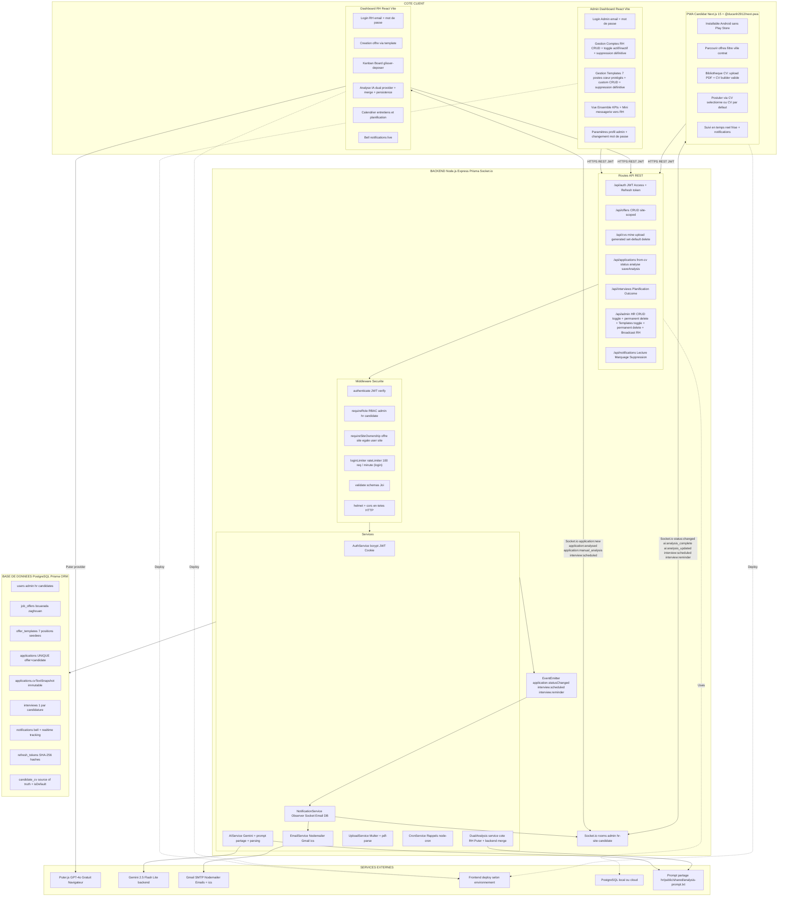

# Architecture Globale — Schulte Tunisia Recruitment Platform
# 2 frontends (HR/Admin React Vite + Candidate Next.js) + 1 backend Express + PostgreSQL

```mermaid
flowchart TB
    subgraph CLIENT ["COTE CLIENT"]
        direction TB

        subgraph ADMIN_APP ["Admin Dashboard React Vite"]
            A1["Login Admin email + mot de passe"]
            A2["Gestion Comptes RH CRUD + toggle actif/inactif + suppression définitive"]
            A3["Gestion Templates 7 postes cœur protégés + custom CRUD + suppression définitive"]
            A4["Vue Ensemble KPIs + Mini messagerie vers RH"]
            A5["Paramètres profil admin + changement mot de passe"]
        end

        subgraph HR_APP ["Dashboard RH React Vite"]
            H1["Login RH email + mot de passe"]
            H2["Creation offre via template"]
            H3["Kanban Board glisser-deposer"]
            H4["Analyse IA dual provider + merge + persistence"]
            H5["Calendrier entretiens et planification"]
            H6["Bell notifications live"]
        end

        subgraph PWA_APP ["PWA Candidat Next.js 15 + @ducanh2912/next-pwa"]
            P1["Installable Android sans Play Store"]
            P2["Parcourir offres filtre ville contrat"]
            P3["Bibliotheque CV: upload PDF + CV builder valide"]
            P4["Postuler via CV selectionne ou CV par defaut"]
            P5["Suivi en temps reel frise + notifications"]
        end
    end

    subgraph BACKEND ["BACKEND Node.js Express Prisma Socket.io"]
        direction TB

        subgraph API ["Routes API REST"]
            R1["/api/auth JWT Access + Refresh token"]
            R2["/api/offers CRUD site-scoped"]
            R3["/api/cvs mine upload generated set-default delete"]
            R4["/api/applications from-cv status analyse saveAnalysis"]
            R7["/api/interviews Planification Outcome"]
            R5["/api/admin HR CRUD toggle + permanent delete + Templates toggle + permanent delete + Broadcast RH"]
            R6["/api/notifications Lecture Marquage Suppression"]
        end

        subgraph SERVICES ["Services"]
            S1["AuthService bcrypt JWT Cookie"]
            S2["AIService Gemini + prompt partage + parsing"]
            S7["DualAnalysis service cote RH Puter + backend merge"]
            S3["NotificationService Observer Socket Email DB"]
            S4["UploadService Multer + pdf-parse"]
            S5["CronService Rappels node-cron"]
            S6["EmailService Nodemailer Gmail ics"]
        end

        subgraph MIDDLEWARE ["Middleware Securite"]
            M1["authenticate JWT verify"]
            M2["requireRole RBAC admin hr candidate"]
            M3["requireSiteOwnership offre site egale user site"]
            M4["loginLimiter rateLimiter 100 req / minute (login)"]
            M5["validate schemas Joi"]
            M6["helmet + cors en-tetes HTTP"]
        end

        SOCKET["Socket.io rooms admin hr-site candidate"]
        EVENTS["EventEmitter application.statusChanged interview.scheduled interview.reminder"]
    end

    subgraph DB ["BASE DE DONNEES PostgreSQL Prisma ORM"]
        T1["users admin hr candidates"]
        T2["job_offers bouarada zaghouan"]
        T3["offer_templates 7 positions seedees"]
        T4["applications UNIQUE offer+candidate"]
        T4A["applications.cvTextSnapshot immutable"]
        T5["interviews 1 par candidature"]
        T6["notifications bell + realtime tracking"]
        T7["refresh_tokens SHA-256 hashes"]
        T8["candidate_cv source of truth + isDefault"]
    end

    subgraph EXTERNE ["SERVICES EXTERNES"]
        EXT1["Puter.js GPT-4o Gratuit Navigateur"]
        EXT2["Gemini 2.5 Flash Lite backend"]
        EXT3["Gmail SMTP Nodemailer Emails + ics"]
        EXT4["Frontend deploy selon environnement"]
        EXT5["PostgreSQL local ou cloud"]
        EXT6["Prompt partage hr/public/shared/analysis-prompt.txt"]
    end

    ADMIN_APP -->|"HTTPS REST JWT"| API
    HR_APP -->|"HTTPS REST JWT"| API
    PWA_APP -->|"HTTPS REST JWT"| API

    HR_APP <-->|"Socket.io application:new application:analysed application:manual_analysis interview:scheduled"| SOCKET
    PWA_APP <-->|"Socket.io status:changed ai:analysis_complete ai:analysis_updated interview:scheduled interview:reminder"| SOCKET

    API --> MIDDLEWARE
    MIDDLEWARE --> SERVICES
    SERVICES --> EVENTS
    EVENTS --> S3
    S3 --> SOCKET
    S3 --> S6
    SERVICES --> DB

    S2 --> EXT2
    S2 --> EXT6
    S7 --> EXT6
    S6 --> EXT3
    HR_APP -->|"Puter provider"| EXT1

    ADMIN_APP -. "Deploy" .-> EXT4
    HR_APP -. "Deploy" .-> EXT4
    PWA_APP -. "Deploy" .-> EXT4
    API -. "Uses" .-> EXT5
```
