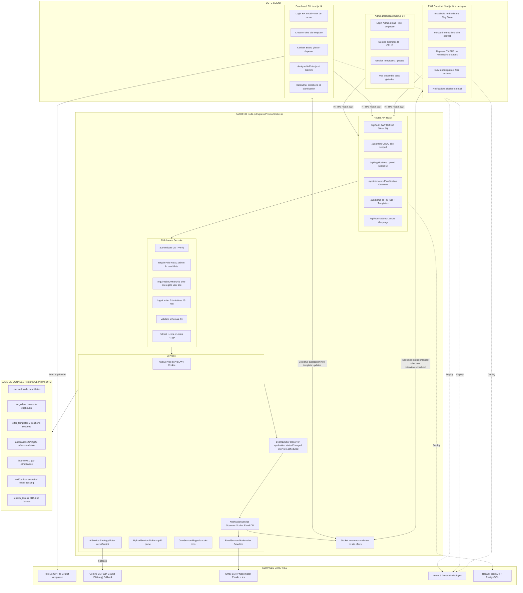

# Architecture Globale — Schulte Tunisia Recruitment Platform
# 3 applications Next.js + 1 backend Express + PostgreSQL

```mermaid
flowchart TB
    subgraph CLIENT ["COTE CLIENT"]
        direction TB

        subgraph ADMIN_APP ["Admin Dashboard Next.js 14"]
            A1["Login Admin email + mot de passe"]
            A2["Gestion Comptes RH CRUD"]
            A3["Gestion Templates 7 postes"]
            A4["Vue Ensemble stats globales"]
        end

        subgraph HR_APP ["Dashboard RH Next.js 14"]
            H1["Login RH email + mot de passe"]
            H2["Creation offre via template"]
            H3["Kanban Board glisser-deposer"]
            H4["Analyse IA Puter.js et Gemini"]
            H5["Calendrier entretiens et planification"]
        end

        subgraph PWA_APP ["PWA Candidat Next.js 14 + next-pwa"]
            P1["Installable Android sans Play Store"]
            P2["Parcourir offres filtre ville contrat"]
            P3["Deposer CV PDF ou Formulaire 5 etapes"]
            P4["Suivi en temps reel frise animee"]
            P5["Notifications cloche et email"]
        end
    end

    subgraph BACKEND ["BACKEND Node.js Express Prisma Socket.io"]
        direction TB

        subgraph API ["Routes API REST"]
            R1["/api/auth JWT Refresh Token 30j"]
            R2["/api/offers CRUD site-scoped"]
            R3["/api/applications Upload Status IA"]
            R4["/api/interviews Planification Outcome"]
            R5["/api/admin HR CRUD + Templates"]
            R6["/api/notifications Lecture Marquage"]
        end

        subgraph SERVICES ["Services"]
            S1["AuthService bcrypt JWT Cookie"]
            S2["AIService Strategy Puter vers Gemini"]
            S3["NotificationService Observer Socket Email DB"]
            S4["UploadService Multer + pdf-parse"]
            S5["CronService Rappels node-cron"]
            S6["EmailService Nodemailer Gmail ics"]
        end

        subgraph MIDDLEWARE ["Middleware Securite"]
            M1["authenticate JWT verify"]
            M2["requireRole RBAC admin hr candidate"]
            M3["requireSiteOwnership offre site egale user site"]
            M4["loginLimiter 5 tentatives 15 min"]
            M5["validate schemas Joi"]
            M6["helmet + cors en-tetes HTTP"]
        end

        SOCKET["Socket.io rooms candidate hr site offers"]
        EVENTS["EventEmitter Observer application.statusChanged interview.scheduled"]
    end

    subgraph DB ["BASE DE DONNEES PostgreSQL Prisma ORM"]
        T1["users admin hr candidates"]
        T2["job_offers bouarada zaghouan"]
        T3["offer_templates 7 positions seedees"]
        T4["applications UNIQUE offer+candidate"]
        T5["interviews 1 par candidature"]
        T6["notifications socket et email tracking"]
        T7["refresh_tokens SHA-256 hashes"]
    end

    subgraph EXTERNE ["SERVICES EXTERNES"]
        EXT1["Puter.js GPT-4o Gratuit Navigateur"]
        EXT2["Gemini 1.5 Flash Gratuit 1500 req/j Fallback"]
        EXT3["Gmail SMTP Nodemailer Emails + ics"]
        EXT4["Vercel 3 frontends deployes"]
        EXT5["Railway prod API + PostgreSQL"]
    end

    ADMIN_APP -->|"HTTPS REST JWT"| API
    HR_APP -->|"HTTPS REST JWT"| API
    PWA_APP -->|"HTTPS REST JWT"| API

    HR_APP <-->|"Socket.io application:new template:updated"| SOCKET
    PWA_APP <-->|"Socket.io status:changed offer:new interview:scheduled"| SOCKET

    API --> MIDDLEWARE
    MIDDLEWARE --> SERVICES
    SERVICES --> EVENTS
    EVENTS --> S3
    S3 --> SOCKET
    S3 --> S6
    SERVICES --> DB

    S2 -->|"Fallback"| EXT2
    S6 --> EXT3
    HR_APP -->|"Puter.js primaire"| EXT1

    ADMIN_APP -. "Deploy" .-> EXT4
    HR_APP -. "Deploy" .-> EXT4
    PWA_APP -. "Deploy" .-> EXT4
    API -. "Deploy" .-> EXT5
```
