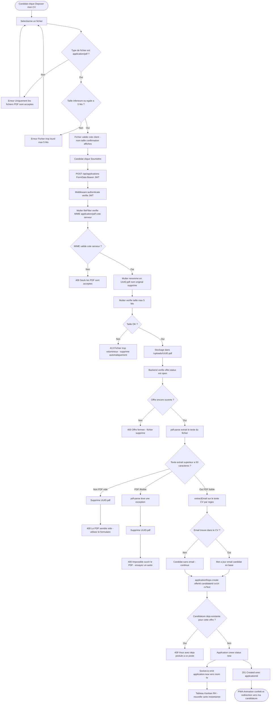

# Flowchart — Depot de CV et Traitement Backend
# Du choix candidat jusqu'au stockage securise en base

```mermaid
flowchart TD
    A([Candidat clique Deposer mon CV]) --> B[Selectionne un fichier]
    B --> C{Type de fichier est application/pdf ?}

    C -- Non --> D["Erreur Uniquement les fichiers PDF sont acceptes"]
    D --> B

    C -- Oui --> E{Taille inferieure ou egale a 5 Mo ?}
    E -- Non --> F["Erreur Fichier trop lourd max 5 Mo"]
    F --> B

    E -- Oui --> G["Fichier valide cote client - nom taille confirmation affiches"]
    G --> H[Candidat clique Soumettre]
    H --> I[POST /api/applications FormData Bearer JWT]

    I --> J[Middleware authenticate verifie JWT]
    J --> K[Multer fileFilter verifie MIME application/pdf cote serveur]

    K --> L{MIME valide cote serveur ?}
    L -- Non --> N["400 Seuls les PDF sont acceptes"]

    L -- Oui --> O["Multer renomme en UUID.pdf nom original supprime"]
    O --> P[Multer verifie taille max 5 Mo]
    P --> Q{Taille OK ?}
    Q -- Non --> R["413 Fichier trop volumineux - supprime automatiquement"]

    Q -- Oui --> S["Stockage dans /uploads/UUID.pdf"]
    S --> T[Backend verifie offer.status est open]
    T --> U{Offre encore ouverte ?}
    U -- Non --> V["400 Offre fermee - fichier supprime"]

    U -- Oui --> W[pdf-parse extrait le texte du fichier]
    W --> X{Texte extrait superieur a 50 caracteres ?}

    X -- Non PDF vide --> Y[Supprime UUID.pdf]
    Y --> Z["400 Le PDF semble vide - utilisez le formulaire"]

    X -- PDF illisible --> AA[pdf-parse leve une exception]
    AA --> AB[Supprime UUID.pdf]
    AB --> AC["400 Impossible ouvrir le PDF - essayez un autre"]

    X -- Oui PDF lisible --> AD[extractEmail sur le texte CV par regex]
    AD --> AE{Email trouve dans le CV ?}

    AE -- Oui --> AF[Met a jour email candidat en base]
    AE -- Non --> AG[Candidat sans email - continue]

    AF --> AH[applicationRepo.create offerId candidateId cvUrl cvText]
    AG --> AH

    AH --> AI{Candidature deja existante pour cette offre ?}
    AI -- Oui --> AK["409 Vous avez deja postule a ce poste"]
    AI -- Non --> AL["Application creee status new"]

    AL --> AM[Socket.io emit application:new vers room hr]
    AM --> AN[Tableau Kanban RH - nouvelle carte instantanee]
    AL --> AO[201 Created avec applicationId]
    AO --> AP([PWA Animation confetti et redirection vers ma candidature])
```
