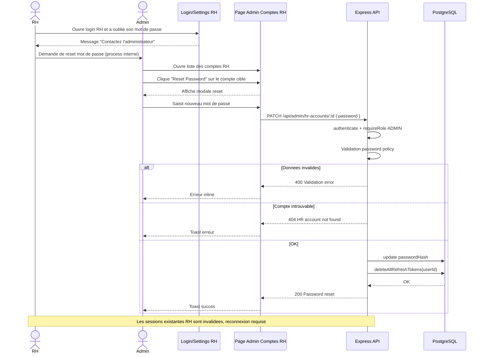

# Diagramme de Sequence — Reset Mot de Passe RH (Admin-Managed)
# Le RH ne change plus son mot de passe depuis ses parametres.

```mermaid
sequenceDiagram
    actor RH as RH
    actor Admin as Admin
    participant HRUI as Login/Settings RH
    participant AdminUI as Page Admin Comptes RH
    participant API as Express API
    participant DB as PostgreSQL

    RH->>HRUI: Ouvre login RH et a oublie son mot de passe
    HRUI-->>RH: Message "Contactez l'administrateur"

    RH->>Admin: Demande de reset mot de passe (process interne)

    Admin->>AdminUI: Ouvre liste des comptes RH
    Admin->>AdminUI: Clique "Reset Password" sur le compte cible
    AdminUI-->>Admin: Affiche modale reset
    Admin->>AdminUI: Saisit nouveau mot de passe

    AdminUI->>API: PATCH /api/admin/hr-accounts/:id { password }
    API->>API: authenticate + requireRole ADMIN
    API->>API: Validation password policy

    alt Donnees invalides
        API-->>AdminUI: 400 Validation error
        AdminUI-->>Admin: Erreur inline
    else Compte introuvable
        API-->>AdminUI: 404 HR account not found
        AdminUI-->>Admin: Toast erreur
    else OK
        API->>DB: update passwordHash
        API->>DB: deleteAllRefreshTokens(userId)
        DB-->>API: OK
        API-->>AdminUI: 200 Password reset
        AdminUI-->>Admin: Toast succes
    end

    Note over RH, API: Les sessions existantes RH sont invalidees, reconnexion requise
```
