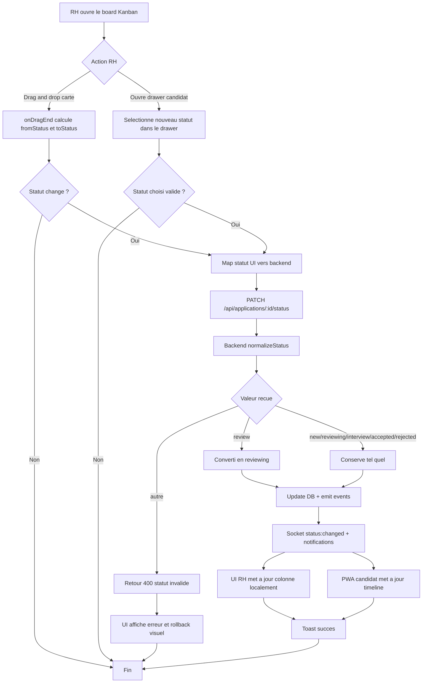

# Diagramme d'Activite — Mise a Jour Statut Kanban RH
# UX actuelle: drag-and-drop conserve + changement via drawer.

```mermaid
flowchart TD
    A[RH ouvre le board Kanban] --> B{Action RH}

    B -->|Drag and drop carte| C[onDragEnd calcule fromStatus et toStatus]
    B -->|Ouvre drawer candidat| D[Selectionne nouveau statut dans le drawer]

    C --> E{Statut change ?}
    E -->|Non| Z[Fin sans requete]
    E -->|Oui| F[Map statut UI vers backend]

    D --> G{Statut choisi valide ?}
    G -->|Non| Z
    G -->|Oui| F

    F --> H[PATCH /api/applications/:id/status]
    H --> I[Backend normalizeStatus]
    I --> J{Valeur recue}

    J -->|review| K[Converti en reviewing]
    J -->|new/reviewing/interview/accepted/rejected| L[Conserve tel quel]
    J -->|autre| M[Retour 400 statut invalide]

    K --> N[Update DB + emit events]
    L --> N

    N --> O[Socket status:changed + notifications]
    O --> P[UI RH met a jour colonne localement]
    O --> Q[PWA candidat met a jour timeline]
    P --> R[Toast succes]
    Q --> R

    M --> S[UI affiche erreur et rollback visuel]
    S --> Z
    R --> Z[Fin]
```
