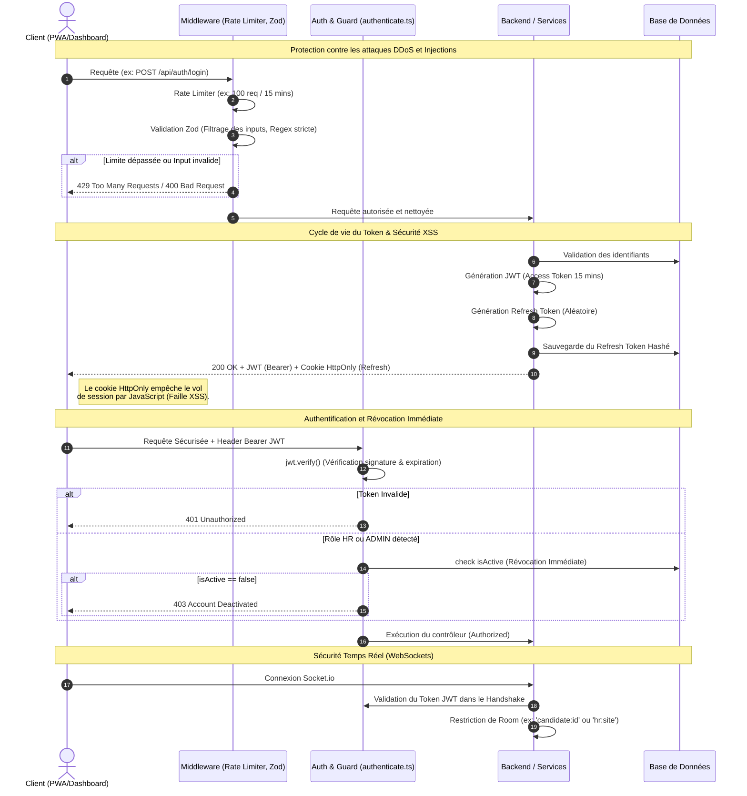

# 17. Architecture de Sécurité (Protection et Accès)

Ce diagramme illustre les mesures de protection mises en place sur l'ensemble de la plateforme (PWA, RH, Admin) : authentification via JWT, protection CSRF/XSS, Rate Limiting, validation Zod, et révocation immédiate.

