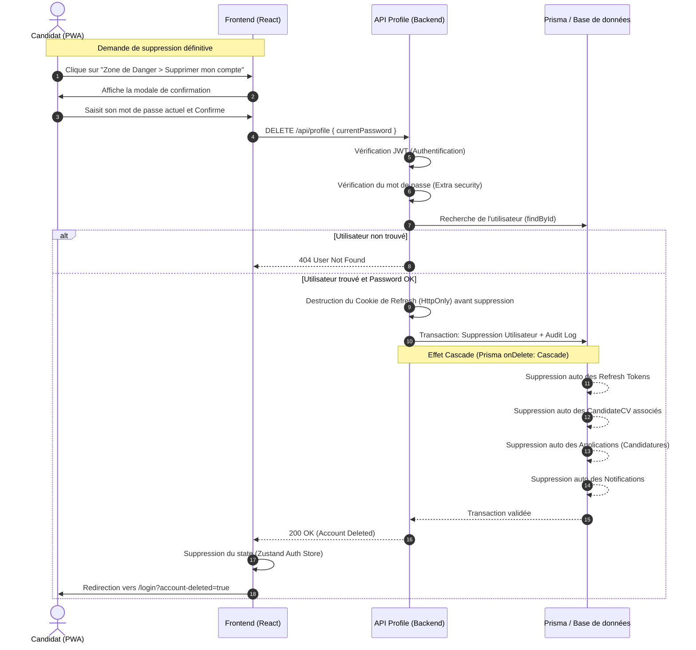

# 18. Conformité RGPD & Droit à l'Oubli

Ce diagramme illustre le flux de suppression d'un compte (Droit à l'oubli / RGPD). Il montre comment l'application garantit une suppression définitive et complète des données personnelles (CV, candidatures, sessions) d'un candidat grâce au système de "Cascade Delete" du moteur Prisma (ORM).

